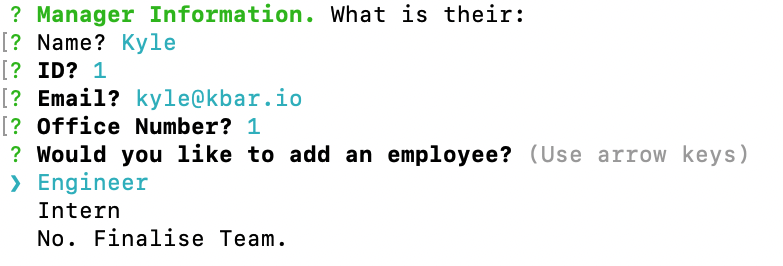

# TeamGener8tor
     

## Description
TeamGener8tor is a CLI application that accepts user inputs and dynamically creates a HTML page from them.

Essentially, the user story is that:

 - You are a manager of software company and you want to make a visual of all employees (Manager, Engineers, and Interns)
 - You want to input the name, id, email and a fourth variable depending on the employee types (office number, github username, and school for employee types respectively).
 - You want to be able to add one manager, and as many engineers and interns as you wish.
 - Once all employees are enter, a html page is generated for you to visualise.
 - The emails on the html page are links that allow you to email said email and the githubs are links to the engineers profiles.

 TeamGener8tor is created using JavaScript on the client side with node.js, Inquirer and Jest for unit testing.

## Table of Contents
- [TeamGener8tor](#teamgener8tor)
  - [Description](#description)
  - [Table of Contents](#table-of-contents)
  - [Installation](#installation)
  - [Usage](#usage)
    - [Initialising](#initialising)
    - [Unlimited Employee Additions](#unlimited-employee-additions)
  - [Contribute to TeamGener8tor](#contribute-to-teamgener8tor)
  - [Tests](#tests)
  - [Questions](#questions)
  - [Credits](#credits)
    - [Tutorials](#tutorials)
    - [Third-Party Assets](#third-party-assets)
  - [License](#license)

## Installation
The repo can be installed on your local machine by cloning using the below code. Navigate to the directory you wish to store the repo and run:

    git clone https://github.com/kbario/TeamGener8tor

## Usage

### Initialising

To start TeamGener8tor, navigate to where the repo exists on your local machine and run:

    node index.js

### Unlimited Employee Additions

The app is built on a loop that will loop until you say you no longer want to add employees. Thus, you can add as many employees as you wish. Overflow of employee card on the html visualisation becomes scrollable.

## Contribute to TeamGener8tor

All contributions to TeamGener8tor are greatly appreciated and contributing is one of the many amazing things about open-source software.

To contribute to TeamGener8tor, all we ask is that you're empathic and supportive towards other developers and follow the standard contribution guidelines. Click the banner below for more information.
        

## Tests
    git clone https://github.com/kbario/TeamGener8tor

    node index.js

## Questions
If you have any questions, feel free to contact me through my [GitHub](https://github.com/kbario/) or [Email me](mailto:kylebario1@gmail.com).

## Credits
Below are lists of links to tutorials and third-party assets that were used to create this project.

### Tutorials
- https://pakstech.com/blog/inquirer-js/
- https://jestjs.io/
- https://github.com/SBoudrias/Inquirer.js/tree/master/packages
- https://blog.dennisokeeffe.com/blog/2021-10-27-jest-with-github-actions
### Third-Party Assets
- https://nodejs.org/en/
- https://www.npmjs.com/package/inquirer
- https://jestjs.io/
- https://tailwindcss.com/

## License
Licensed under the [MIT](./LICENSE.txt) license.

---
This README was created with [Gener8aREADME](https://github.com/kbario/Gener8aREADME).
