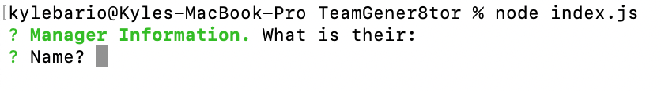

# TeamGener8tor
     

## Description
TeamGener8tor is a CLI application that accepts user inputs about team members in a software development company and dynamically creates a HTML page displaying this info with interactive and clickable sections from this.

**User Story**
 - You are a manager of software company and you want to make a visual of all employees (the Manager (yourself), Engineers, and Interns).
 - You want to input the name, id, and email for all employees as well as fourth variable that depending on the employee's role (office number, github username, and school for respective employee types).
 - You want to be able to add one manager, and as many engineers and interns as you wish.
 - Once all employees are entered, a html page is dynamically generated for you to visualise your team.
 - The emails on the html page as well as the GitHub usernames are clickable links that allow you send emails and view GitHub profiles at the click of a button.

View the actually html page produced by TeamGener8tor [here](https://kbario.github.io/TeamGener8tor/)

TeamGener8tor is created using JavaScript on the server side with Node.js, the Node.js Inquirer package, and Jest for unit testing.

This project strengthened my skills with classes and extending classes in JavaScript as well as utilising multiple files as custom modules that are ultimately used in the main index.js file.

## Table of Contents
  - [Installation](#installation)
  - [Usage](#usage)
    - [Initialising TeamGener8tor](#initialising-teamgener8tor)
    - [Unlimited Employee Additions](#unlimited-employee-additions)
    - [Viewing the Created HTML File](#viewing-the-created-html-file)
  - [Contribute to TeamGener8tor](#contribute-to-teamgener8tor)
  - [Tests](#tests)
  - [Questions](#questions)
  - [Credits](#credits)
    - [Tutorials](#tutorials)
    - [Third-Party Assets](#third-party-assets)
  - [License](#license)

## Installation
The repo can be installed on your local machine by cloning using the below code. Navigate to the directory you wish to store the repo and run:

    git clone https://github.com/kbario/TeamGener8tor

## Usage

### Initialising TeamGener8tor

To start the application, navigate to where the repo exists on your local machine and run:

    node index.js

### Unlimited Employee Additions

The app is built so that you are able to add as many employees as you wish. The app's visualisation is mobile and dark-mode friendly, and handles large amounts of employees with a scrollable interface.

### Viewing the Created HTML File

Once you add the information for your last employee, and select "No. Finalise Team." in the menu, a message will display in the console. Either `HTML unsuccessfully saved` or `HTML successfully saved. Find it here: ./dist/index.html`. If you see the second, you can click on the file path and it will take you to the HTML file. From their you can view it in the browser.

## Contribute to TeamGener8tor

All contributions to TeamGener8tor are greatly appreciated and contributing is one of the many amazing things about open-source software.

To contribute to TeamGener8tor, all we ask is that you're empathic and supportive towards other developers and follow the standard contribution guidelines. Click the banner below for more information.
        

## Tests
    git clone https://github.com/kbario/TeamGener8tor
    node index.js

This project also contains **Jest** tests and the passing status of these test can be found at the top of this README.

## Questions
If you have any questions, feel free to contact me through my [GitHub](https://github.com/kbario/) or [Email me](mailto:kylebario1@gmail.com).

## Credits
Below are lists of links to tutorials and third-party assets that were used to create this project.

### Tutorials
- https://pakstech.com/blog/inquirer-js/
- https://jestjs.io/
- https://github.com/SBoudrias/Inquirer.js/tree/master/packages
- https://blog.dennisokeeffe.com/blog/2021-10-27-jest-with-github-actions
- https://stackoverflow.com/questions/52377344/javascript-array-of-instances-of-a-class
- https://tailwindcss.com/docs/installation
- https://developer.mozilla.org/en-US/docs/Web/JavaScript/Reference/Classes
### Third-Party Assets
- https://nodejs.org/en/
- https://www.npmjs.com/package/inquirer
- https://jestjs.io/
- https://tailwindcss.com/
- https://heroicons.com/
- https://shields.io/

## License
Licensed under the [MIT](./LICENSE.txt) license.

---
This README was created with [Gener8aREADME](https://github.com/kbario/Gener8aREADME).
